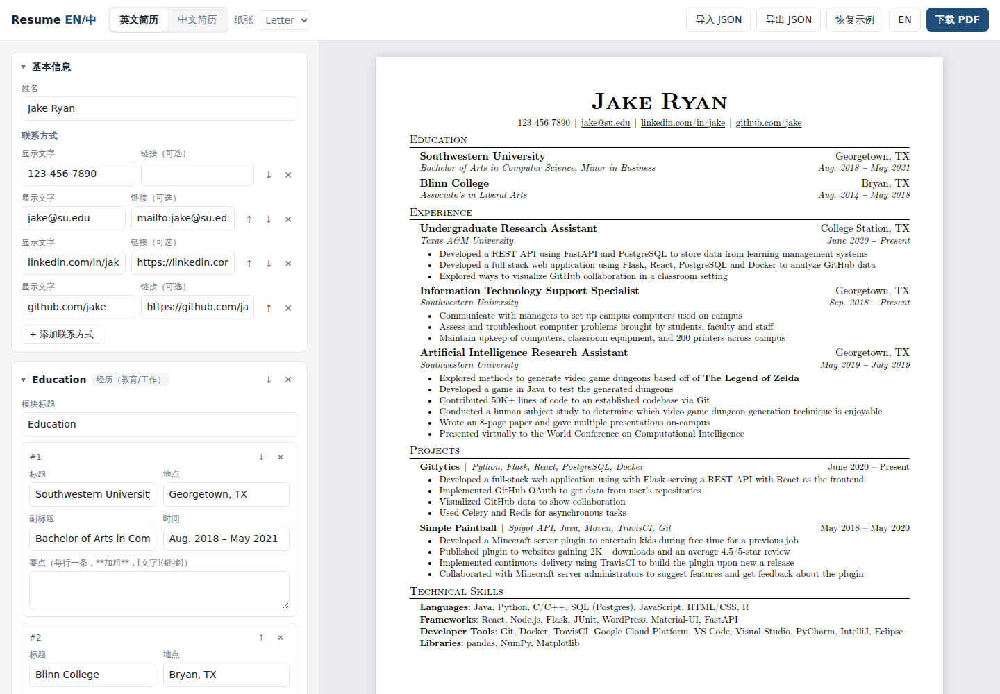
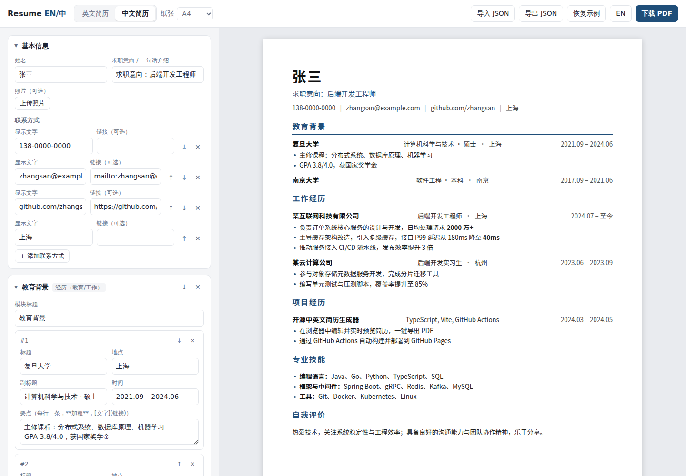
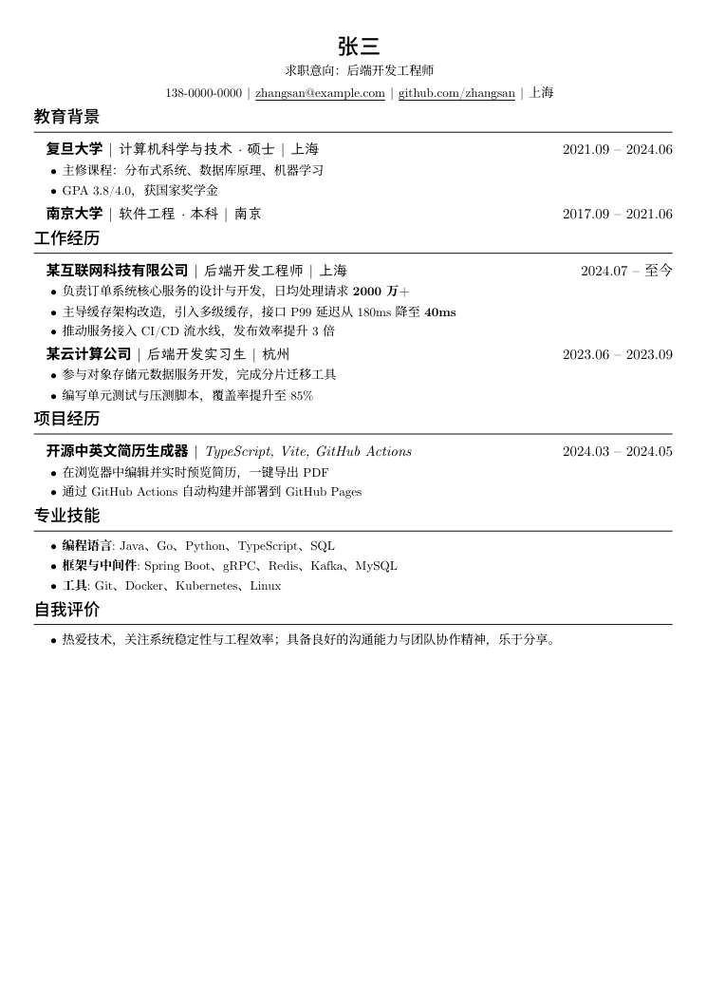
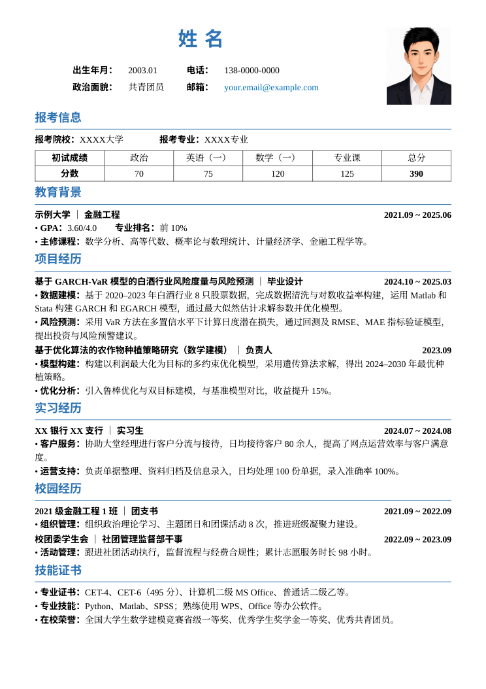
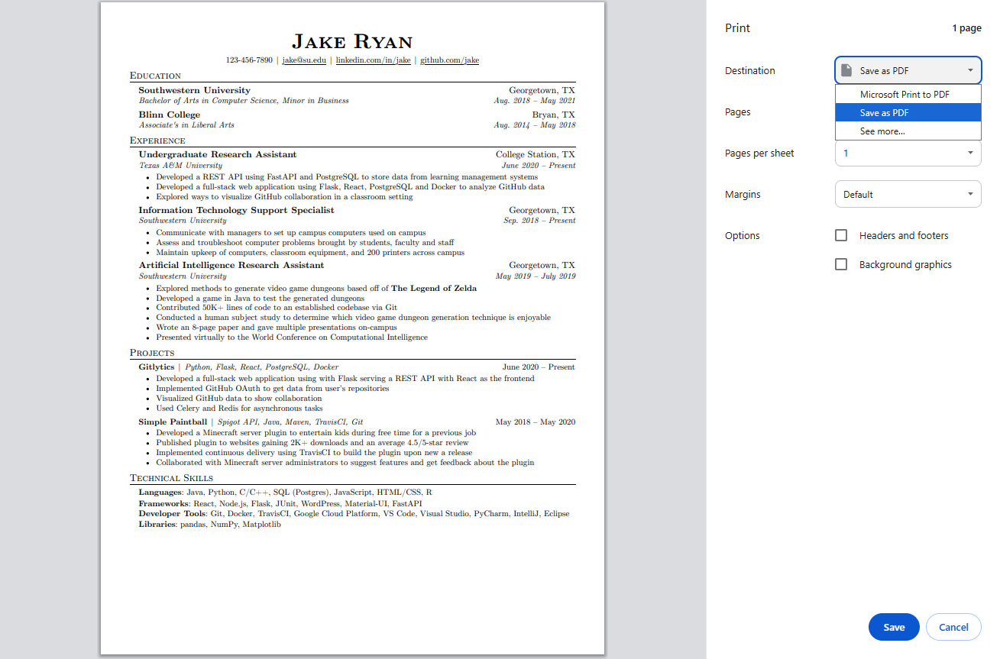
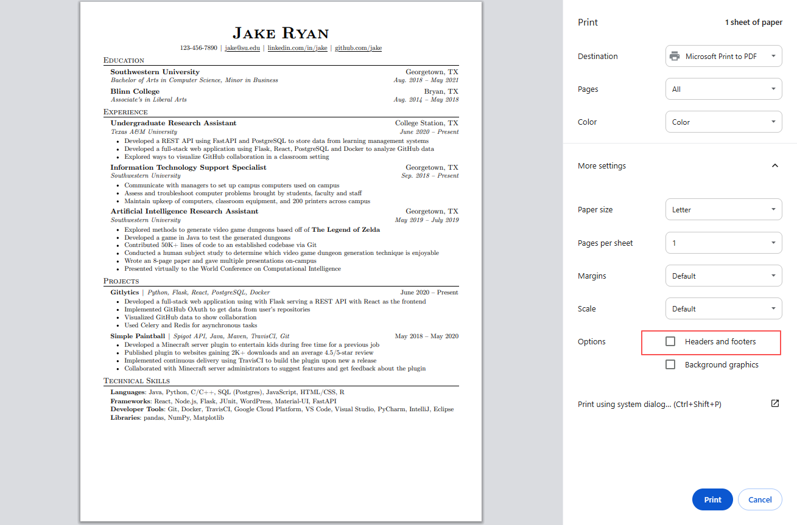

# Resume EN/CH - 中英文简历生成器

[English](#english) | 中文

一个开源、纯前端的中英文简历生成网页：在浏览器里填写内容、实时预览，一键导出 PDF。数据只保存在你自己的浏览器里，不上传任何服务器。

- **英文模板**：复刻 Overleaf 上最经典的 [Jake's Resume](https://github.com/jakegut/resume)（Computer Modern 字体、小型大写标题、横线分隔）
- **中文模板（简洁）**：简洁整洁的单栏布局，内置思源黑体（Noto Sans SC），可选证件照
- **Resume-NG 模板**：参考 [fky2015/resume-ng](https://github.com/fky2015/resume-ng) 的高信息密度排版（黑体标题、宋体正文、楷体补充信息），中英文简历都可用
- **考研复试模板**：参考 [kody1126/Chinese-resume-template-postgraduate](https://github.com/kody1126/Chinese-resume-template-postgraduate)，蓝色标题、个人信息栏、证件照，以及置顶的「报考信息」模块（报考院校、专业、研究方向和初试成绩表，总分自动计算）。切换到该模板时如果还没有报考信息，会自动在最前面加上
- 在顶部「模板」下拉框里随时切换模板，内容不变；「恢复示例」会载入当前模板的示例
- 「表格」模块：每行一行，单元格用 `|` 分隔，适合放初试成绩等
- **导出 PDF**：使用浏览器打印生成矢量 PDF，文字可选中、可被 ATS 解析
- **导入 / 导出 JSON**：方便备份和版本管理；自动保存到 localStorage
- **导出 LaTeX**：下载 .tex 源文件，可在 Overleaf 等编辑器里继续修改。英文导出为 Jake's Resume 格式（pdfLaTeX 编译）；中文导出为基于 ctex 的版式（需用 XeLaTeX 编译）
- 自由增删、排序模块和条目，支持 `**加粗**` 与 `[文字](链接)`
- 支持 Letter / A4 纸张，预览中用红色虚线标出分页位置






## 下载 PDF

点击右上角「下载 PDF」，在打印窗口中：

1. 目标打印机选择 **另存为 PDF**（Save as PDF）。不要选 “Microsoft Print to PDF”，它会丢掉邮箱、GitHub 等可点击链接



2. 在「更多设置」里**取消勾选「页眉和页脚」**（Headers and footers），否则 PDF 顶部和底部会多出日期、网址和页码。Chrome 会记住这个选择，只需设置一次



推荐使用 Chrome / Edge，排版与预览最一致。

## 本地开发

```bash
npm install
npm run dev      # 本地开发
npm test         # 单元测试
npm run build    # 构建到 dist/
```

## 部署（GitHub Actions → GitHub Pages）

仓库自带 `.github/workflows/deploy.yml`：每次 PR 会跑测试和构建，推送到 `main` 后自动部署到 GitHub Pages。
首次使用需在仓库 **Settings → Pages → Build and deployment → Source** 选择 **GitHub Actions**。

## 目录结构

```
src/
  templates/jake.ts   英文模板（Jake's Resume）
  templates/zh.ts     中文模板（简洁）
  templates/ng.ts     Resume-NG 模板
  templates/fushi.ts  考研复试模板
  templates/index.ts  模板注册表（名称、适用语言、页边距）
  styles/resume.css   两套模板的排版样式
  editor.ts           左侧表单编辑器
  latex.ts            导出 LaTeX（.tex）
  store.ts            本地存储与 JSON 导入校验
  samples.ts          示例数据
```

新增模板：在 `src/templates/` 写一个 `render(resume) => html` 函数，在 `src/templates/index.ts` 注册，并在 `resume.css` 里加样式即可。

## 致谢与许可

- 英文模板版式来自 [Jake Gutierrez 的 Jake's Resume](https://github.com/jakegut/resume)（MIT），示例内容亦出自该模板
- Resume-NG 模板的版式参考 [Feng Kaiyu 的 Resume-NG](https://github.com/fky2015/resume-ng)（LPPL 1.3c），本项目用 HTML/CSS 重新实现，未复制其 LaTeX 代码
- 考研复试模板的版式与示例内容参考 [Kody 的中文考研复试简历模板](https://github.com/kody1126/Chinese-resume-template-postgraduate)（MIT）
- 字体：[CMU Serif](https://cm-unicode.sourceforge.io/)（SIL OFL）、[Noto Sans SC / Noto Serif SC](https://fonts.google.com/noto)（SIL OFL，经 Fontsource 分包加载）、[霞鹜文楷 LXGW WenKai](https://github.com/lxgw/LxgwWenKai)（SIL OFL）、[Tinos](https://fonts.google.com/specimen/Tinos)（Apache 2.0，系统没有 Times New Roman 时使用）
- 本项目代码使用 [MIT](LICENSE) 许可

---

## English

An open-source, client-side resume generator for English and Chinese resumes. Edit in the browser with a live preview and export a PDF in one click. Your data stays in your browser.

- **English template**: a faithful HTML port of [Jake's Resume](https://github.com/jakegut/resume), the most popular resume template on Overleaf (Computer Modern, small-caps headings, rules)
- **Chinese template (Simple)**: a clean single-column layout with bundled Noto Sans SC and an optional photo
- **Resume-NG template**: a dense layout modeled on [fky2015/resume-ng](https://github.com/fky2015/resume-ng), for Chinese or English resumes; switch templates from the *Template* menu without losing content
- **Postgraduate (考研复试) template**: modeled on [kody1126/Chinese-resume-template-postgraduate](https://github.com/kody1126/Chinese-resume-template-postgraduate), with an info grid, photo and an exam-score table (new *Table* section type)
- **PDF export** through the browser's print engine: vector output, selectable, ATS-friendly text
- JSON import/export and automatic saving to localStorage
- **LaTeX export**: download a .tex file to keep editing in Overleaf. English resumes export as Jake's Resume (pdfLaTeX); Chinese resumes as a ctex document (XeLaTeX)
- Add, remove and reorder sections and entries; `**bold**` and `[text](url)` in bullets
- Letter / A4, with page-break guides in the preview

**Saving the PDF:** click *Download PDF*, choose *Save as PDF* as the destination (not *Microsoft Print to PDF*, which drops clickable links), and under *More settings* untick *Headers and footers* so the browser does not add the date, URL and page numbers (see the screenshot above; Chrome remembers it). Chrome or Edge gives the closest match to the preview.

**Development:** `npm install`, `npm run dev`, `npm test`, `npm run build`.

**Deployment:** `.github/workflows/deploy.yml` tests and builds every PR and deploys `main` to GitHub Pages. Set *Settings → Pages → Source* to *GitHub Actions* once.

Licensed under [MIT](LICENSE). Layout of the English template from Jake Gutierrez's Jake's Resume (MIT); Resume-NG layout after Feng Kaiyu's Resume-NG (LPPL 1.3c), reimplemented in HTML/CSS; postgraduate layout and sample after Kody's template (MIT). Fonts: CMU Serif, Noto Sans/Serif SC and LXGW WenKai (SIL OFL), Tinos (Apache 2.0).
